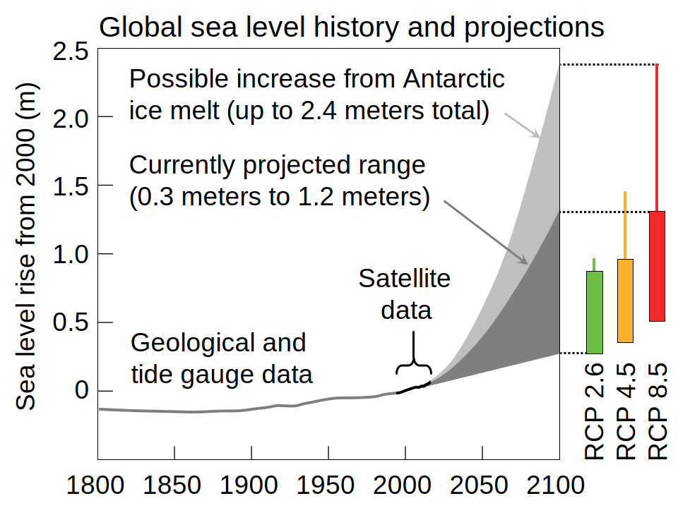

`#KaburAjaDulu` adalah tagar yang populer, berisi ajakan bagi anak muda untuk
pergi ke luar negeri, baik untuk menempuh pendidikan, bekerja, bahkan pindah
kewarganegaraan. Sudah ada banyak yang membahas dari berbagai sudut pandang.
Saya ingin membahas dari sudut pandang yang belum pernah tersentuh, yaitu dari
sudut pandang perubahan iklim.

<!-- truncate -->

## Yang Akan Terjadi di Masa Depan Akibat Perubahan Iklim

Akibat perubahan iklim, daerah dengan derajat lintang tinggi akan mendapatkan
lebih sedikit masalah terkait produksi pangan, bahkan memiliki potensi
meningkatkan produksi. Sebaliknya, daerah tropis akan mengalami penurunan
produksi pangan. [^1]

Perubahan iklim juga menyebabkan kenaikan permukaan laut, yang bisa mencapai
lebih dari 60 cm pada tahun 2100 dibandingkan dengan tahun ini. [^2] Dengan
garis pantai Indonesia yang sangat panjang, tidak mungkin dampak kenaikan
permukaan laut bisa diatasi di semua lokasi. Akan ada di antara kita yang mau
tidak mau memang harus mengungsi, baik ke daerah lain di Indonesia, atau ke luar
negeri.

<figure>

<figcaption>Proyeksi kenaikan permukaan laut. [^4]</figcaption>
</figure>

Perubahan iklim akan memaksa manusia melakukan migrasi menjauhi khatulistiwa,
menjauhi garis pantai, pulau kecil, dan daerah kering. Hutan juga perlu
dihindari karena risiko kebakaran yang semakin besar. Populasi manusia akan
bergerak menjauhi pantai, mendekati danau, lokasi yang lebih tinggi, dan daerah
lintang tinggi di utara. [^3] 

## Pelan-Pelan dan Santai, atau Cepat dan Semrawut?

Saat ini peluang untuk memperbaiki masalah iklim praktis nol, jadi kita hanya
bisa mencoba beradaptasi. Ada dua skenario utama yang dapat terjadi.

### Skenario Baik: Pelan-Pelan dan Santai

Dampak perubahan iklim terjadi, tapi lambat sehingga manusia bisa beradaptasi
sedikit demi sedikit tanpa mengubah pola kehidupan secara drastis. Perkembangan
teknologi mampu membantu kita beradaptasi. Dampak perubahan iklim akan
dikonversi menjadi inflasi, dan kita akan bereaksi terhadapnya seperti biasa,
misalnya dengan membatasi jumlah keturunan, atau mengurangi konsumsi.

Sebenarnya saat ini pun kita sedang melakukan adaptasi perubahan iklim. Kita
melihat harga-harga naik, dan bereaksi terhadapnya. Tapi umumnya kita tidak
menyadari bahwa di balik kenaikan harga tersebut terdapat komponen dampak
perubahan iklim.

### Skenario Buruk: Cepat dan Semrawut

Semoga yang terjadi adalah skenario baik di atas, tetapi juga ada peluang dampak
perubahan iklim terjadi dengan cepat, di luar kemampuan kita untuk beradaptasi.

Apa yang akan terjadi jika misalnya terjadi gagal panen atau kekeringan yang
sangat lama? Kelaparan, kerusuhan, kekacauan sosial, ketidakstabilan politik.
Suka tak suka, mau tak mau, bagaimana pun caranya, jumlah populasi akan
berkurang sampai di bawah *[carrying
capacity](https://en.wikipedia.org/wiki/Carrying_capacity)* yang baru, misalnya
dengan kematian masal karena kelaparan, penyakit, atau perang.

## Pilihan Untuk `#KaburAjaDulu`

Dengan melihat kondisi tersebut, sebenarnya `#KaburAjaDulu` adalah pilihan yang
logis: lebih baik menghindari peluang terjadinya skenario buruk.

Dan lebih baik pula untuk melakukan `#KaburAjaDulu` sekarang saat tidak ada
krisis. Negara-negara lain akan lebih dapat menerima, dan lebih mudah
beradaptasi dengan lingkungan di negara tersebut. Saat ini, banyak negara-negara
tersebut sedang mengalami krisis demografi, dan mereka membutuhkan tenaga kerja
muda. Jadi, jika anda kompeten, dan keahlian anda dibutuhkan negara tersebut,
banyak yang akan menyambut baik kedatangan anda.

Alternatifnya, kita mengambil risiko untuk terpaksa melakukan `#KaburAjaDulu` di
masa depan saat terjadi skenario buruk di atas. Kita akan menjadi bagian dari
krisis pengungsi yang akan terjadi, dan akan jauh lebih sulit untuk dapat
diterima di negara lain.

## `#KaburAjaDulu` Tidak Nasionalis?

Perubahan iklim adalah masalah global yang terjadi karena **kegagalan institusi
negara** untuk membatasi emisi CO2 dan gas rumah kaca lainnya. Ini
berlaku untuk praktis semua negara, bukan hanya Indonesia saja.

Jadi tidak pantas jika ada negara yang melakukan tekanan emosional kepada
anak-anak muda warganya agar tetap bermukim di dalam negeri. Yang gagal adalah
negara, tapi yang nanti akan merasakan dampak perubahan iklim adalah anak-anak
muda ini, bukan angkatan saya atau pejabat-pejabat negara ini.

Bukan hanya itu, walaupun sudah tahu dampaknya terhadap perubahan iklim,
petinggi negara jaman sekarang masih gemar membuat keputusan yang merugikan
dalam konteks perubahan iklim. Politisi cenderung hanya memprioritaskan
kepentingan jangka pendek, selama waktu mereka menjabat saja, dan tidak mampu
melihat misalnya 50 tahun ke depan.

Seringkali, yang emosional terhadap isu nasionalisme ini adalah orang-orang yang
sama yang merayakan ketika timnas sepakbola Indonesia menang, timnas yang berisi
pemain-pemain yang melakukan `#KaburAjaDulu`, hanya berbeda negara tujuannya
saja.

Seandainya suatu saat ada yang sukses sebagai emigran, katakanlah seperti [Rishi
Sunak](https://en.wikipedia.org/wiki/Rishi_Sunak), [Jensen
Huang](https://en.wikipedia.org/wiki/Jensen_Huang), [Elon
Musk](https://en.wikipedia.org/wiki/Elon_Musk), [Sundar
Pichai](https://en.wikipedia.org/wiki/Sundar_Pichai), [Satya
Nadella](https://en.wikipedia.org/wiki/Satya_Nadella), [Sergey
Brin](https://en.wikipedia.org/wiki/Sergey_Brin), dapat kita prediksi nanti
orang-orang yang sama ini akan dengan senang hati mengklaim hal tersebut adalah
"kebanggaan bangsa", "keberhasilan bangsa mengelola SDM", atau omong kosong
lainnya yang sama-sama kita ketahui bersama.

## Negara Tujuan `#KaburAjaDulu`

Dari sudut pandang perubahan iklim, negara tujuan mana yang paling baik untuk
`#KaburAjaDulu`?

Negara-negara empat musim dengan derajat lintang tinggi. Perubahan iklim
melumerkan lahan yang tertutup es, dan membuka lahan pekerjaan baru. Perubahan
iklim juga membuka lokasi-lokasi pinggir pantai yang sebelumnya tertutup es,
sehingga bisa dijadikan pelabuhan dan lokasi industri.

Jadi: Skandinavia, Kanada, Eropa Timur, Amerika Serikat, Rusia, Selandia Baru,
Argentina, Chile.

Tentunya bukan hanya faktor perubahan iklim saja yang harus diperhatikan, tapi
hal tersebut di luar cakupan tulisan ini.

## Dampak `#KaburAjaDulu` Terhadap Negara Yang Ditinggalkan

Banyak yang berpendapat bahwa `#KaburAjaDulu` akan merugikan negara. Tapi gagal
melihat sisi positifnya:

* Mengurangi tekanan populasi terhadap penggunaan sumber daya alam. Dan
  mengurangi dampak jika terjadi skenario buruk.
* Pelaku `#KaburAjaDulu` tetap memiliki ikatan emosional dengan negara asalnya,
  dan akan tetap berkontribusi kepada negara asalnya walaupun tidak secara
  langsung.
* Akan menjadi kekuatan ekonomi dan politik di negara tujuan. Hal ini akan
  berguna apabila nantinya di Indonesia terjadi skenario buruk di atas.

Dari sudut pandang perubahan iklim, dapat dikatakan masa depan kita sebagai
bangsa yang tinggal di garis Khatulistiwa tergantung dari keberhasilan kita
dalam melakukan `#KaburAjaDulu`.

## Leluhur Kita Juga Melakukan `#KaburAjaDulu`

<figure>

<figcaption>Rute `#KaburAjaDulu` manusia jaman dulu. [^5]</figcaption>
</figure>

Leluhur kita dulu juga melakukan `#KaburAjaDulu`. Itu sebabnya kita bisa ada di
sini sekarang. Mereka meninggalkan Afrika, dan menyebar ke seluruh dunia, baik
untuk menghindari bencana atau mencari kehidupan yang lebih baik. Leluhur kita
bahkan berhasil `#KaburAjaDulu` dari Nusantara, mengarungi lautan luas untuk
mencapai Madagaskar dan sukses menetap di sana.

Bedanya dengan sekarang, jaman dulu masalahnya adalah teknologi. Sekarang
teknologi tidak lagi menjadi penghalang. Yang menjadi penghalang utama di jaman
sekarang adalah batas negara.

[^1]: [Hannah Ritchie (2024) - How will climate change affect crop yields in the future?](https://ourworldindata.org/will-climate-change-affect-crop-yields-future)
[^2]: [Rebecca Lindsey - Climate Change: Global Sea Level](https://www.climate.gov/news-features/understanding-climate/climate-change-global-sea-level)
[^3]: [Gaia Vince - Where We’ll End Up Living as the Planet Burns](https://time.com/6209432/climate-change-where-we-will-live/)
[^4]: [Wikimedia Commons - File:Sea level history and projections.svg](https://commons.wikimedia.org/wiki/File:Sea_level_history_and_projections.svg)
[^5]: [Wikimedia Commons - File:Early migrations mercator.svg](https://commons.wikimedia.org/wiki/File:Early_migrations_mercator.svg)