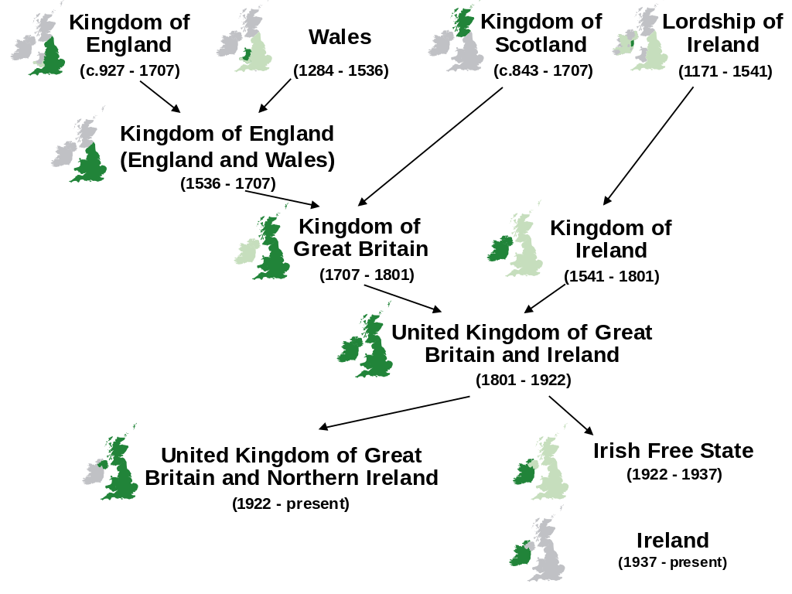

Teori saya mengapa Indonesia menggunakan istilah 'Inggris' untuk menyebut
'United Kingdom'.

<!-- truncate -->

Bahasa-bahasa Eropa Barat menggunakan sistem
[demonim](https://en.wikipedia.org/wiki/Demonym), mereka menggunakan istilah
berbeda untuk menyebut warga negara dan untuk menyebut nama negaranya.
Sebaliknya, bahasa di Nusantara menggunakan istilah yang sama; kita hanya akan
menyebut penduduk di Indonesia dengan sebutan 'orang Indonesia'.

Dulu kita bertemu pertama kali dengan orang Eropa jauh sebelum tahu negaranya.
Karena mereka menyebut diri mereka sendiri dengan sebutan 'English' dan
'Hollander', maka kita berasumsi istilah tersebut sama dengan nama negara
mereka, sesuai dengan kebiasaan lokal.

<table>

<tr>
<th>Nama Negara</th>
<th>Nama Penduduk</th>
<th>Setelah Diserap</th>
</tr>

<tr>
<td>England</td>
<td>English</td>
<td>Inggris</td>
</tr>

<tr>
<td>España</td>
<td>Español</td>
<td>Spanyol</td>
</tr>

<tr>
<td>Portugal</td>
<td>Português</td>
<td>Portugis</td>
</tr>

<tr>
<td>France</td>
<td>Français</td>
<td>Prancis</td>
</tr>

<tr>
<td>Holland</td>
<td>Hollander</td>
<td>Belanda</td>
</tr>

</table>

## Kasus United Kingdom

<figure>

<figcaption>United Kingdom</figcaption>
</figure>

Bangsa Inggris pertama kali ke Nusantara pada abad 16-17. Saat itu, belum ada
'United Kingdom', yang ada adalah 'Kingdom of England' (Inggris + Wales).

Saat James Cook [berlabuh di Batavia](https://en.wikipedia.org/wiki/First_voyage_of_James_Cook) tahun 1770, negara mereka bernama 'Kingdom
of Great Britain' (Inggris + Wales + Skotlandia).

Saat [Sir Stamford Raffles](https://en.wikipedia.org/wiki/Stamford_Raffles)
menjadi Gubernur Jenderal Pulau Jawa tahun 1811-1816 dan Gubernur Bengkulu tahun
1818-1824, mereka sudah berubah menjadi 'United Kingdom of Great Britain and
Ireland' (Inggris + Wales + Skotlandia + Irlandia). Begitu pula saat [Alfred
Russel Wallace](https://en.wikipedia.org/wiki/Alfred_Russel_Wallace) melakukan
penelitian di Nusantara tahun 1854-1862.

Saat pasukan mereka [mendarat di
Surabaya](https://en.wikipedia.org/wiki/Battle_of_Surabaya) tahun 1945, negara
mereka sudah berubah nama menjadi 'United Kingdom of Great Britain and Northern
Ireland' (Inggris + Wales + Skotlandia + Irlandia Utara).

Namun karena kebiasaan dan perubahaan sistem politik mereka tidak berpengaruh
pada kita, saat ini kita masih menyebut mereka dengan sebutan 'Inggris'.