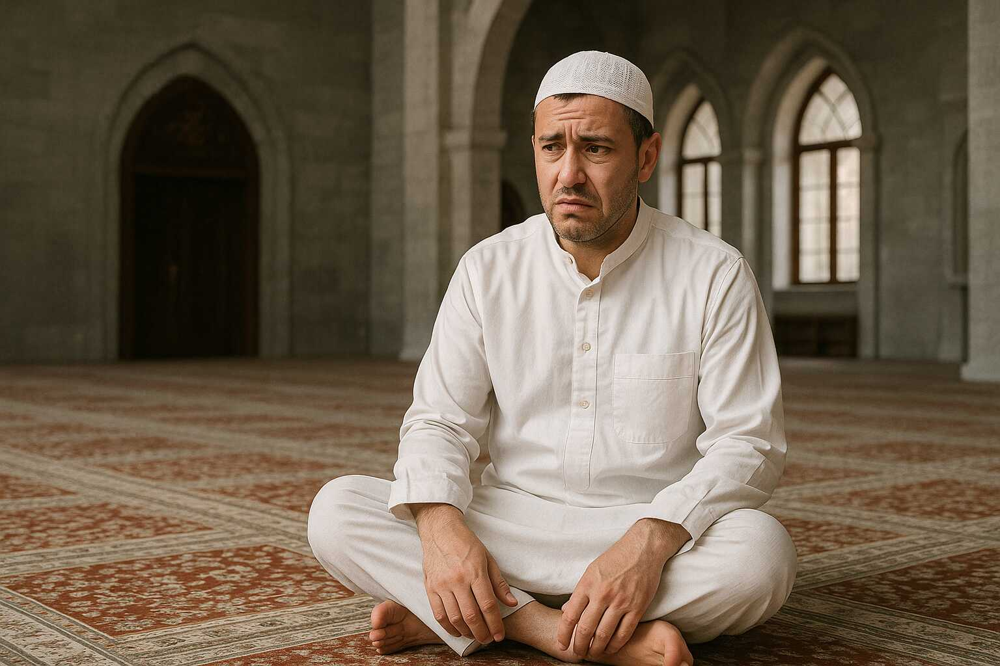

Saya memiliki masalah dengan posisi duduk bersila, apalagi dalam waktu lama.
Jika dilakukan cukup lama, maka kaki akan kesemutan, kepala pusing, dan mata
berkunang-kunang.

Dulu pernah mendapat guru agama yang selalu memaksakan siswa-siswanya untuk
duduk bersila dengan postur yang tertib. Jika *selonjoran*, kaki tidak dilipat,
atau lutut dinaikkan, maka dianggap tidak sopan, dan akan ditegur atau bahkan
mendapatkan hukuman.

<!-- truncate -->

Beliau tidak menyadari posisi tersebut membuat orang-orang seperti saya sangat
menderita. Setelah satu jam pelajaran, terkadang kaki tidak bisa dirasakan atau
kesemutan luar biasa. Perlu istirahat beberapa menit dengan posisi yang enak
sebelum bisa pulih kembali.

Jika makan di restoran Sunda, saya selalu memilih duduk di kursi. Jika harus
lesehan, maka kaki akan saya luruskan, atau *selonjoran*.

Ayah saya pernah mengalami stroke saat di posisi duduk bersila. Jadi ada
kemungkinan masalah tersebut memiliki pengaruh genetik.

Saya tidak tahu apakah ada orang lain yang mengalami hal yang sama. Tapi dari
pengamatan saya ke orang-orang sekitar dari dulu sampai sekarang, hanya saya
yang mengalami hal tersebut. Orang lain sepertinya merasa posisi duduk bersila
itu nyaman, dan tidak ada masalah dengan posisi tersebut.

Sebagai perbandingan, posisi duduk tasahud dalam shalat jauh lebih nyaman
daripada duduk bersila. Dan duduk tasahud akhir lebih nyaman daripada tasahud
awal. Walaupun posisi tersebut hanya dilakukan sebentar saja, tidak seperti
duduk bersila yang biasa dilakukan misalnya saat mendengarkan ceramah. Dan
tentunya masih lebih nyaman *selonjoran* atau duduk di kursi.

Jadi setiap kali melihat ada guru agama yang menegur siswa yang tidak tertib
duduk bersila, hal tersebut menjadi masalah bagi saya. 

Pesan saya untuk guru agama: jangan hukum siswa yang tidak bisa tertib duduk
bersila, karena mungkin mereka memiliki fisiologi yang berbeda dari siswa yang
lain. Mereka tidak tertib karena tubuh mereka bereaksi terhadap posisi yang
mungkin akan berisiko bagi mereka, bukan karena mereka nakal.

## Bacaan Lain

* [Kenapa Duduk Sila Bikin Kaki Sering Kesemutan?](https://klinikpintar.id/blog-pasien/kenapa-duduk-sila-bikin-kaki-sering-kesemutan) - Klinik Pintar
* [Mitos atau Fakta, Duduk Bersila Berdampak Buruk untuk Kesehatan](https://www.halodoc.com/artikel/mitos-atau-fakta-duduk-bersila-berdampak-buruk-untuk-kesehatan) - Halodoc