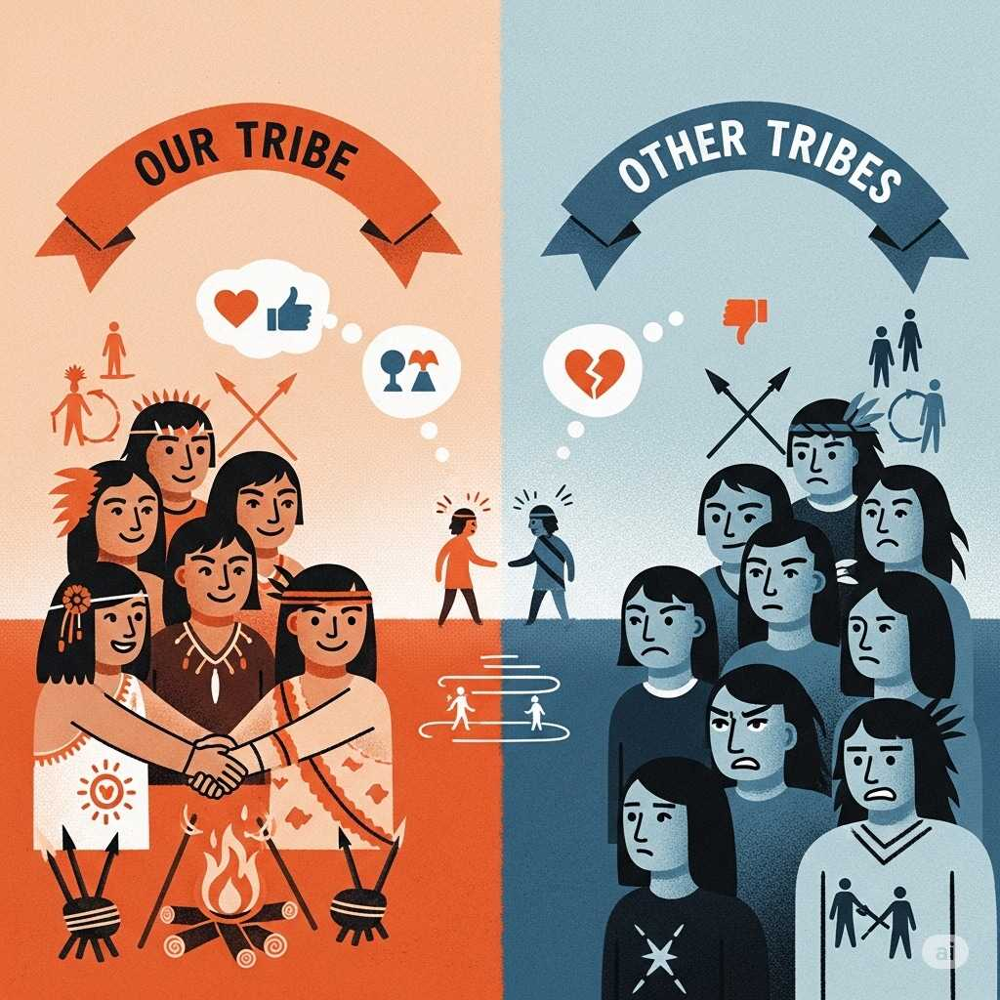

Saat perang kemerdekaan, kita perang memperjuangkan kebebasan dan keadilan
sosial. Untuk membedakan siapa di pihak kita dan siapa di pihak lawan, kita
menggunakan institusi negara beserta simbol-simbolnya. Mereka yang berbendera
merah putih kita anggap sebagai kawan yang sama-sama mencari kebebasan, dan
mereka yang berbendera merah putih biru adalah agresor.

Masalahnya adalah ketika kita terjebak memperlakukan negara dan simbol-simbolnya
seakan itu adalah tujuan akhir. Kemudian simbol-simbol tersebut bagi kita hanya
sekadar menjadi alat untuk membedakan mana yang
[*in-group*](https://en.wikipedia.org/wiki/In-group_favoritism) dan mana yang
*out-group*.

<!-- truncate -->

## Paradigma Grup Minimal

Pada tahun 1970-an, ilmuwan Henri Tajfel melakukan beberapa eksperimen yang
dikenal sebagai [paradigma grup
minimal](https://en.wikipedia.org/wiki/Minimal_group_paradigm). Eksperimen ini
melibatkan beberapa subjek, yang dibagi menjadi dua grup dengan kriteria remeh,
yang tidak relevan dan tidak ada artinya. Misalnya, subjek dibagi menjadi dua
grup berdasarkan warna yang disukai, merah atau biru.

Setelah itu, subjek diminta untuk memberikan hadiah kepada peserta lain.
Hasilnya, subjek cenderung memberikan hadiah yang lebih banyak kepada anggota
grupnya sendiri, walaupun mereka dipersatukan oleh hal remeh seperti sama-sama
menyukai warna biru.

## Tribalisme

Sifat tersebut adalah yang mendasari
[tribalisme](https://en.wikipedia.org/wiki/Tribalism). Zaman dahulu, manusia
purba yang dapat hidup berkelompok memiliki peluang bertahan hidup yang lebih
besar. Sekonyol apa pun konsep yang dapat mempersatukan mereka, hal tersebut
akan membantu mereka bertahan hidup. Manusia yang tak memiliki sifat tersebut
memiliki peluang lebih kecil untuk bertahan hidup dan akan punah. Yang tersisa
hanyalah manusia yang memiliki sifat tersebut, dan sifat tersebut diwariskan
sampai sekarang, menjadi bagian dari diri kita.

Di zaman modern, sifat tersebut dapat dikatakan
[*vestigial*](https://en.wikipedia.org/wiki/Vestigiality). Kita masih memiliki
sifat tersebut, tapi manfaatnya terhadap kelangsungan hidup umat manusia semakin
berkurang. Dalam beberapa kasus bahkan merugikan. Sifat tribalisme tak
terkendali menyebabkan [politik ekstrem
kanan](https://en.wikipedia.org/wiki/Far-right_politics) yang berbahaya dan tak
lagi sesuai dengan perkembangan nilai di zaman modern. Sifat ini juga menghambat
kita untuk mengatasi masalah-masalah dunia yang membutuhkan kerja sama dari
kelompok-kelompok yang berbeda di seluruh dunia.

## Hubungannya Dengan Kewarganegaraan

Dalam konteks kewarganegaraan, negara dan simbol-simbolnya seperti bendera, lagu
kebangsaan, lambang negara, dan atribut-atribut lainnya adalah konsep pemersatu.
Kita membedakan mana yang kelompok kita dan mana yang bukan menggunakan
simbol-simbol tersebut, terkadang tanpa memperhitungkan apakah memang ada nilai
yang diwakili oleh simbol tersebut, ataukah hanya sekadar simbol yang abstrak.

Kita merasa adalah hal lumrah menghormati secarik kain dengan corak dan warna
tertentu, sambil menyanyikan sebuah lagu dengan bangga. Orang-orang di negara
lain juga melakukan hal yang sama, hanya berbeda corak & warna kain, dan juga
lagunya.

Jika ada alien yang mengamati kita dari luar angkasa, mereka akan melihat kita
dengan
[*cringe*](https://chatgpt.com/share/68a02123-bf08-8008-826c-fd0d09711f6c), sama
seperti saat kita melihat suku terbelakang menggunakan totem dan ritual tarian
untuk membedakan suku mereka dari suku lain.

## Simbol Bukanlah Hal Yang Diwakili Simbol Tersebut

Anak-anak diajarkan bahwa mempertaruhkan nyawa untuk mencari secarik bendera ke
dalam hutan belantara adalah hal yang positif, bukan sesuatu yang konyol.
Padahal bendera hanyalah sesuatu yang bisa dibeli dan dibuat kembali dengan
mudah, tanpa mempengaruhi apapun.

Apa bedanya dengan misalnya [insiden Hotel
Yamato](https://id.wikipedia.org/wiki/Insiden_Hotel_Yamato)? Saat itu dalam
situasi hampir perang. Orang-orang yang merobek bendera tersebut melakukannya
bukan karena benderanya bukan merah putih, tapi karena sesuatu yang diwakili
oleh bendera tersebut.

Mempersamakan simbol abstrak seperti bendera dengan hal konkret yang diwakilinya
adalah cacat logika yang dinamakan [*reification
fallacy*](https://en.wikipedia.org/wiki/Reification_(fallacy)).

## Kompetisi Dengan Simbol Lain

Bukan tidak mungkin terdapat simbol lain yang mewakili ide yang sama dengan yang
(seharusnya) diwakili oleh simbol negara. Namun jika kita terjebak menganggap
bahwa simbol negara adalah tujuan akhir, kita akan keliru menganggap simbol lain
tersebut sebagai kompetitor. Yang penting tentunya bukan simbol apa yang
digunakan, tetapi apa tujuan yang diwakili oleh simbol tersebut.

## Ultranasionalisme di Indonesia

Indonesia adalah negara yang sangat nasionalis, yang merupakan ciri khas dari
negara-negara yang memerdekakan diri dari kolonialisme. Terlebih lagi, saat
perang dingin, pihak barat menggunakan ultranasionalisme sebagai alat untuk
melawan komunisme di Indonesia. Hasilnya, selama puluhan tahun, negara kita
dikuasai oleh [kediktatoran sayap
kanan](https://en.wikipedia.org/wiki/Right-wing_dictatorship).

Dengan penguasaan rezim ekstrem kanan yang
[militeristik](https://en.wikipedia.org/wiki/Militarism), maka diterapkanlah
berbagai sistem pengkultusan dan penghormatan berlebihan terhadap simbol-simbol
negara. Setelah runtuhnya rezim tersebut, terdapat banyak ritual yang tidak lagi
dilakukan, namun saat ini masih bisa kita temukan sisa-sisa peninggalan zaman
tersebut, seperti misalnya kewajiban upacara bendera, kewajiban menyanyikan lagu
kebangsaan secara berlebihan, dan pemasangan foto presiden di institusi
pendidikan dan pemerintahan.

Itu adalah hal-hal yang akan terlihat *cringe* dari sudut pandang kebanyakan
orang di luar negara kita, bahkan dari sudut pandang warga negara yang dulunya
meng-*install* rezim kanan di negara kita sekali pun.

## Terus *Gimana*?

*Progress* tidak bisa dipaksakan, tetapi harus dilakukan secara perlahan,
dimulai dari diri kita sendiri. Dapat dikatakan dalam hal ini negara memang
sedang mengalami *regression*. Namun hal tersebut tidak hanya terjadi di
Indonesia, dan lebih merupakan perkembangan global yang terjadi di seluruh
dunia, jadi kita tidak perlu berkecil hati.

Keterikatan kita dengan simbol-simbol abstrak, termasuk simbol negara, adalah
kelemahan kita sebagai manusia, namun kita dapat meminimalkan dampaknya dengan
menyadari hal tersebut.

Tetap fokus pada idealisme di balik simbol tersebut, seperti kebebasan,
keadilan, dan persamaan hak. Waspada terhadap pihak yang ingin menyalahgunakan
simbol-simbol negara sebagai sumber kekuasaan dan untuk kepentingan mereka
sendiri, apalagi jika bertentangan dengan nilai-nilai sesungguhnya yang berada
di balik simbol tersebut. Waspada terhadap pengkultusan dan pemujaan berlebihan
terhadap simbol-simbol negara.

## Merdeka!

Merdeka adalah terlepas dari keterikatan psikologis terhadap simbol-simbol
semata, yang jika berdiri sendiri hanyalah sesuatu yang abstrak, dan hanya
efektif sebagai alat untuk membedakan mana orang kita dan mana orang lain.

Merdeka adalah berusaha memperlakukan pihak lain yang mengenakan simbol berbeda
dengan cara yang sama seperti kita memperlakukan orang-orang yang mengenakan
simbol yang sama dengan kita, tanpa diskriminasi, tanpa prasangka.

Merdeka adalah menyadari bahwa negara adalah sebuah alat politik yang kita
gunakan untuk memperoleh idealisme bagi kita sebagai bagian dari umat manusia,
namun bukanlah tujuan akhir itu sendiri.