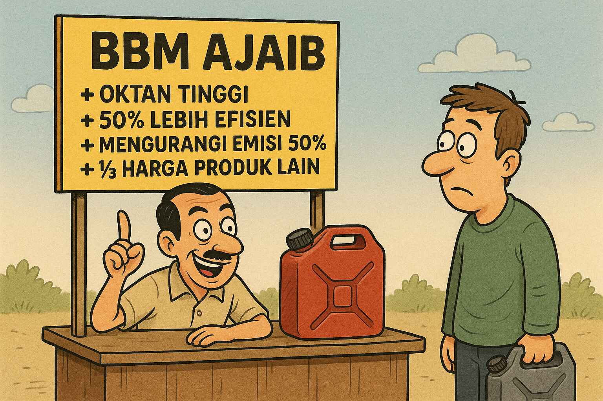

Setiap beberapa tahun ada saja produk-produk ajaib berupa bahan bakar murah,
penghemat bahan bakar, atau pernak-pernik lain yang menjanjikan harga murah,
peningkatan efisiensi bahan bakar kendaraan bermotor, atau klaim lainnya.

Polanya selalu sama: di awal penuh dengan euforia dan antusiasme, namun diakhiri
dengan kekecewaan karena hasilnya sama sekali tidak sesuai dengan yang
dijanjikan.

<!--truncate-->

Produk-produk semacam ini memiliki pola yang hampir selalu sama. Berikut adalah
ciri-ciri yang umum ditemukan pada produk-produk tersebut. Ini adalah daftar
umumnya, bukan aturan baku. Tidak semua produk akan memiliki semua ciri-ciri
berikut, namun semua produk akan memiliki hampir semua ciri-ciri berikut ini.

## Klaim Bombastis

Semua produk tersebut memiliki klaim yang bombastis. Contoh:

* Menghemat bahan bakar hingga 50%
* Meningkatkan kinerja mesin hingga 30%
* Mengurangi emisi gas buang hingga 40%
* Harga sangat murah, hanya sepersekian dari produk lain di pasaran
* Mengubah air biasa menjadi bahan bakar

Semua adalah klaim yang mustahil, sulit dicapai, atau tidak realistis untuk
teknologi yang mereka tawarkan.

## Tak Memahami Hukum Alam

Pencetus produk umumnya tidak dapat membedakan mana hukum alam atau keterbatasan
fisika, dan mana masalah yang dapat diatasi melalui rekayasa teknologi. Hukum
kekekalan energi, misalnya, adalah hukum alam yang mustahil dilanggar. Apapun
teknologi yang mereka tawarkan, tidak mungkin dapat menghasilkan energi lebih
banyak daripada yang dimasukkan ke dalam sistem.

Apabila suatu saat mereka ketahuan tidak mampu *deliver*, mereka akan katakan
bahwa "masih membutuhkan penyempurnaan" atau "masih dalam tahap pengembangan".
Padahal, jika klaimnya dari awal sudah melanggar hukum fisika, sekeras apa pun
usaha yang dilakukan tidak akan pernah membuatnya menjadi mungkin.

## Melawan Hukum Ekonomi

Jika produk tersebut menawarkan alternatif yang diklaim sangat jauh lebih murah
daripada produk yang sudah ada di pasaran, maka hal tersebut tidak mungkin
berlangsung lama. Produk yang murah akan mendapat tekanan dari sisi *supply*,
dan produk yang mahal akan mendapat tekanan dari sisi *demand*. Pada akhirnya
harga kedua produk akan mengalami konvergensi ke titik ekuilibrium, dan hal yang
dijanjikan tidak akan pernah tercapai.

Berapa harga ekuilibriumnya? Akan sangat tergantung pada kemampuan *supply* dari
produk yang baru. Dan biasanya mereka terkesan meremehkan kemampuan *supply*
dari produk yang sudah ada, dan membesar-besarkan kemampuan *supply* dari mereka
sendiri.

## Dijual Retail Sendiri

Mereka menjual produknya secara retail, langsung ke konsumen.

Hal ini tentunya patut kita pertanyakan. Jika ada yang punya solusi yang memang
benar-benar dapat menghemat konsumsi bahan bakar hingga 50%, misalnya, mengapa
harus bersusah payah untuk menjualnya secara eceran?

Lebih masuk akal jika teknologinya dilisensikan ke perusahaan besar, atau bahkan
ke pemerintah negara-negara secara langsung. Lalu si peneliti bisa hidup dengan
nyaman dari royalti tanpa harus banyak bekerja.

Bahkan, jika hasilnya memang sesuai yang diklaim, negara-negara yang relatif pro
lingkungan seperti Uni Eropa akan mewajibkan penggunaan teknologi tersebut. Jadi
tidak perlu melakukan pemasaran, membuat jaringan distribusi, dan sebagainya.
Mereka hanya perlu duduk manis menunggu transfer royalti.

## Bumbu Nasionalisme dan Agama

Biasanya produk-produk semacam ini akan disertai bumbu-bumbu nasionalisme atau
agama untuk menambah daya tariknya. Misalnya dengan mengatakan bahwa produk
tersebut adalah hasil karya anak bangsa, atau terinspirasi ayat suci agama
tertentu.

Kenapa mereka melakukannya? Karena di sini trik dagang seperti itu laku keras.
Masyarakat mudah terpengaruh oleh isu nasionalisme dan agama. Jika ada pihak
yang kritis, nanti akan dapat dengan mudah mereka tuduh tidak nasionalis atau
mereka tanya "agamamu apa?"

## Evaluasi Tanpa Pengukuran Ilmiah

Tidak ada pengukuran ilmiah yang jelas untuk mendukung klaim yang dibuat.
Biasanya mereka hanya akan mengandalkan perasaan atau metode pengukuran yang
tidak terkontrol. Contoh:

* Mengukur konsumsi BBM tanpa mengontrol variabel lain.
* Menilai emisi dengan mencium bau knalpot.
* Menilai getaran mesin atau akselerasi menggunakan perasaan.
* Menggunakan testimoni pengguna sebagai bukti, tanpa ada data kuantitatif yang
  jelas.

## Mengandalkan Rahasia Dagang, bukan Paten

Untuk melindungi kepemilikan intelektual, mereka mengandalkan kerahasiaan, bukan
paten. Mereka akan mempresentasikan perangkatnya sebagai sebuah *black box*.
Masyarakat hanya melihat apa masukannya dan apa keluarannya, tanpa tahu apa yang
terjadi di dalamnya.

Bisa saja, dan sudah terjadi, bahwa *output* dari alat tersebut sudah disiapkan
sebelumnya, dan bukan dihasilkan dari proses yang terjadi di dalam *black box*
tersebut. Alhasil, yang kita saksikan adalah pertunjukan sulap, bukan teknologi
yang sesungguhnya.

## Endorsement dari Politisi atau Selebriti

Ciri-ciri lain dari produk-produk semacam ini adalah adanya dukungan dari
politisi, pengusaha, atau selebriti. Ini hanya membuat gaduh, tetapi tidak
mempengaruhi kualitas produk. Jika produknya tidak berfungsi, ya tetap tidak
berfungsi, tidak peduli siapa pun yang mendukungnya.

Masalahnya adalah orang-orang ini adalah orang-orang dengan pengaruh besar, dan
mereka dapat mempengaruhi opini publik atau kebijakan pemerintah.

## Tidak ada Publikasi Ilmiah

Biasanya tidak ada publikasi ilmiah yang berkaitan dengan teknologi yang
digunakan. Apabila kita pertanyakan, mereka akan mengatakan bahwa teknologinya
adalah rahasia perusahaan, dan "Untuk apa kita mempublikasikan sehingga bisa
digunakan orang lain?"

Mereka sepertinya tidak paham bahwa intelektual properti tetap bisa dilindungi
melalui paten. Dan jika mereka mengandalkan rahasia dagang, maka mereka harus
siap jika suatu saat rahasia tersebut bocor, atau ada orang lain yang menemukan
cara yang sama. Lalu mereka akan kehilangan keunggulan kompetitifnya.

## Teori Konspirasi

Teori konspirasi adalah jurus yang bisa mereka lakukan sejak awal, atau hanya
jika sudah terdesak. Contohnya adalah:

* "Mereka" (biasanya adalah pihak asing) tidak menginginkan teknologi ini
  berkembang karena akan mengancam bisnis mereka.
* "Mereka" (biasanya adalah ilmuwan atau lembaga riset besar) menolak teknologi
  ini karena takut kehilangan posisi mereka.
* "Mereka" (biasanya adalah pemerintah) tidak mengizinkan teknologi ini karena
  akan mengurangi pendapatan negara dari pajak dan tidak ingin rakyatnya
  menikmati produk murah.

## Dilakukan Individu atau Tim Kecil

Produk-produk semacam ini biasanya dikembangkan oleh individu atau tim kecil,
dan seringkali tidak melibatkan ilmuwan. Apakah memungkinkan individu atau tim
kecil yang bukan ilmuwan dapat mengembangkan teknologi yang benar-benar
revolusioner, teknologi yang terlewatkan begitu saja oleh ribuan-jutaan ilmuwan
di seluruh dunia?

Bisa saja. Namun jauh lebih memungkinkan jika ini hanyalah
[efek Dunning-Kruger](https://id.wikipedia.org/wiki/Efek_Dunning-Kruger), di mana
orang yang tidak kompeten memiliki kepercayaan diri yang berlebihan terhadap
kemampuannya.

<!-- ## Visi Yang Luar Biasa Sempit -->

<!-- ## Fokus ke Dalam Negeri, Mengabaikan Potensi Ekspor -->
 
<!-- ## Emisi CO2

Sebagian produk mengklaim menurunkan emisi CO2, namun tanpa memahami
implikasinya. Misalnya, jika sebuah produk mengklaim dapat menghemat bahan
bakar hingga 50%, maka secara otomatis emisi CO2 juga akan berkurang hingga 50%.
Namun, jika produk tersebut menggunakan bahan kimia tertentu yang -->
