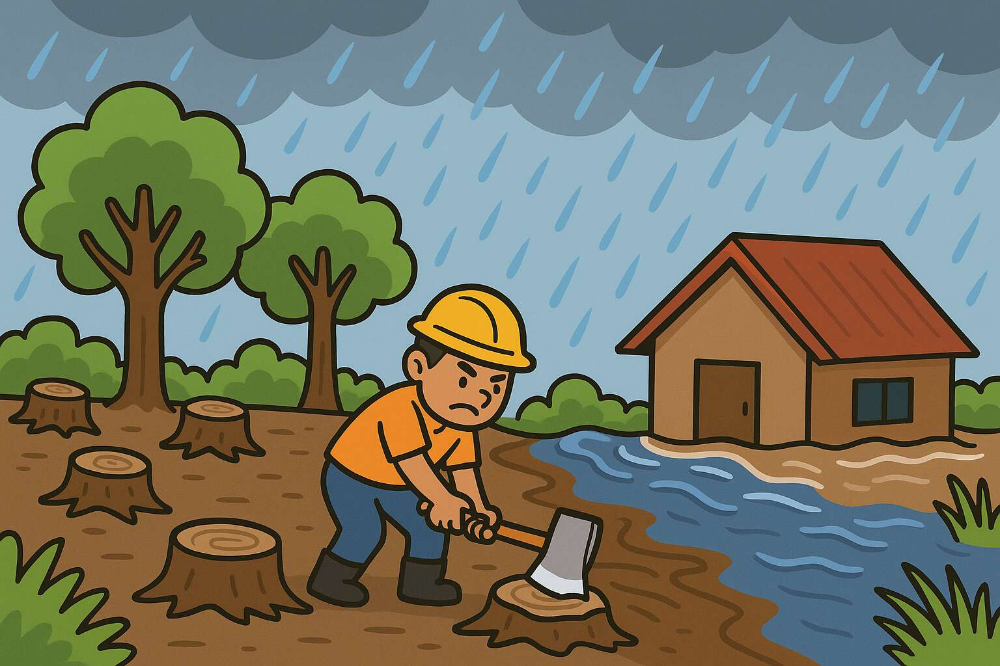
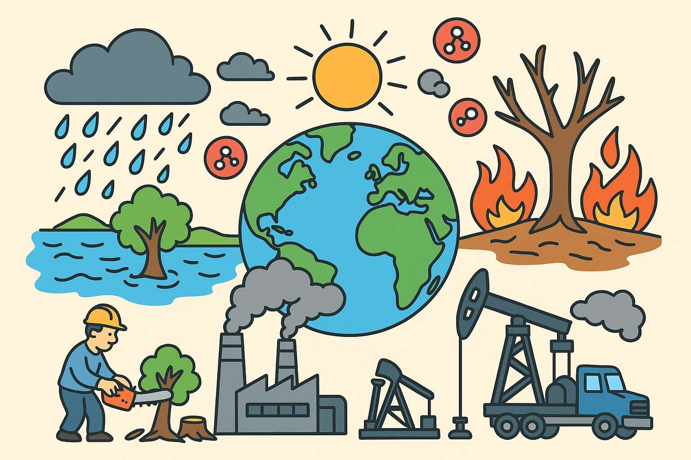
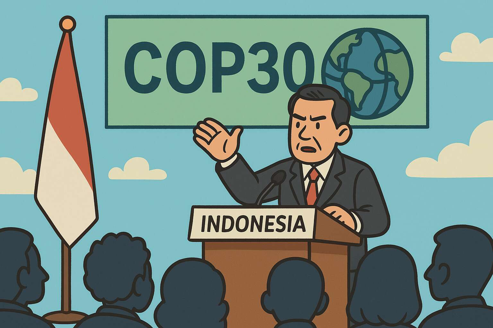

Penebangan hutan bukan **satu-satunya** penyebab banjir Sumatera pada November
2025. Yang benar adalah penebangan hutan di Sumatera hanyalah salah satu dari
sekian banyak kontributor efek rumah kaca yang memperbesar peluang terjadinya
bencana alam seperti banjir di Sumatera, Malaysia, Thailand dan Srilanka pada
akhir tahun 2025.

Berdasarkan yang saya pahami, [curah hujan di daerah bencana sebegitu
tinggi](https://www.facebook.com/marufin.sudibyo/posts/pfbid02hfXBBYwdUyNogaXZBJmri8pqHK9EjE4LVWD2E2UYN5XHem8m5Xe6jVtQqUf6iuqAl),
dan seandainya lokasi adalah hutan belantara murni pun, maka tidak akan sanggup
menyerap air hujan sebanyak itu. Jadi, penebangan hutan hanyalah faktor yang
memperparah situasi. Seandainya sama sekali tidak ada penebangan hutan, hal
tersebut tidak akan mampu 100% mencegah terjadinya bencana banjir tersebut.

Bencana ini dipicu oleh [badai tropis
Senyar](https://en.wikipedia.org/wiki/Cyclone_Senyar) yang sangat jarang
terjadi. Semakin dekat khatulistiwa, maka semakin jarang terjadi badai tropis.
Namun, badai tropis Senyar terjadi [hanya sekitar 3° dari
khatulistiwa](https://en.wikipedia.org/wiki/List_of_tropical_cyclones_near_the_Equator),
lebih dekat ke khatulistiwa daripada Pulau Jawa.

<!--truncate-->

## Penyebab Bencana Yang Sesungguhnya

Penyebab utama sesungguhnya bencana tersebut adalah perubahan iklim global yang
membuat peluang terjadinya kondisi cuaca ekstrem semakin besar, termasuk curah
hujan yang sangat tinggi dalam waktu singkat. Faktor utama perubahan iklim
global adalah emisi gas rumah kaca dari aktivitas manusia, seperti pembakaran
bahan bakar fosil dan deforestasi.

Dimulai sekitar 360 juta tahun yang lalu, organisme di Bumi menyerap karbon dari
atmosfer dan sekaligus menyerap energi dari matahari. Hasilnya kemudian
mengendap di perut bumi. Proses tersebut berlangsung selama ratusan juta tahun,
dan menghasilkan cadangan bahan bakar fosil yang kita gunakan saat ini, seperti
minyak bumi, batu bara, dan gas alam.

Setelah revolusi industri terjadi, manusia mulai menggunakan bahan bakar fosil
dalam skala besar. Akibatnya, karbon yang sedikit demi sedikit terakumulasi di
dalam perut bumi selama ratusan juta tahun kini dilepaskan kembali ke atmosfer
hanya dalam waktu di bawah 200 tahun saja. Gas karbon dioksida (CO₂) dan metana
(CH₄) yang dilepaskan ke atmosfer dari pembakaran bahan bakar fosil ini
meningkatkan efek rumah kaca, yang menyebabkan pemanasan global dan perubahan
iklim.

Perubahan iklim tersebut membuat peluang lebih besar terjadinya cuaca ekstrem
yang memicu bencana. Bencana banjir Asia Tenggara 2025 hanyalah salah satu
kasus. Ada banyak kasus lain seperti kebakaran hutan di Australia, kebakaran Los
Angeles, gelombang panas di Eropa, *hurricane* di Amerika Serikat, dan
sebagainya.

## Siapa Yang Salah?

Yang salah adalah umat manusia secara keseluruhan, tetapi jika kita ingin
menunjuk pihak yang paling bertanggung jawab, maka jawabannya adalah adalah
pihak yang lebih banyak menggali dan mengkonsumsi bahan bakar fosil. Semakin
banyak menggunakan bahan bakar fosil, maka semakin besar kesalahannya.

Lokasi bencana bisa saja di Aceh atau Sumatera Utara, tetapi pihak yang salah
tidak perlu berada di sana, dan kesalahan tidak perlu dilakukan di sana. Molekul
karbondioksida tidak mengenal batas negara. Eksploitasi berlebihan terhadap
hutan di Kalimantan, Papua, atau bahkan di Brasil, semuanya secara kolektif akan
berkontribusi terhadap perubahan iklim global yang membuat peluang lebih besar
terjadinya bencana seperti yang terjadi di Sumatera. Penambangan minyak di Teluk
Meksiko, Arab Saudi, Venezuela, dan Rusia juga memiliki kontribusi yang sama.
Demikian pula penambangan batu bara di Australia, China, India, dan Indonesia.

Kesalahan tersebut juga memiliki sifat lintas generasi. Emisi CO₂ yang terjadi
tahun 1980-an tetap akan berkontribusi terhadap perubahan iklim yang kita alami
sekarang ini, jadi bukan hanya kesalahan generasi sekarang saja. Walaupun
demikian, saat ini kita memiliki pengetahuan mengenai perubahan iklim yang lebih
komprehensif, sehingga generasi sekarang memiliki tanggung jawab moral yang
lebih besar untuk mengurangi emisi gas rumah kaca.

## Posisi Indonesia Saat Ini

Sebagai negara kepulauan di khatulistiwa, Indonesia sangat rentan terhadap
dampak perubahan iklim. Bukan hanya masalah cuaca ekstrem, tetapi juga kenaikan
permukaan laut, dan tekanan terhadap produksi pangan. Oleh karena itu, Indonesia
memiliki kepentingan yang sangat besar untuk mengurangi emisi gas rumah kaca dan
beralih ke sumber energi terbarukan. Sayangnya yang dilakukan Indonesia selama
ini tidak mencerminkan kepentingan tersebut.

Walaupun kondisi sudah semakin mendesak, saat ini Indonesia masih terus [menambah kapasitas pembangkit listrik tenaga
batu bara](https://globalenergymonitor.org/report/indonesias-captive-coal-on-the-uptick/).

Indonesia sayangnya juga tidak termasuk dalam daftar [83 negara yang mendukung
penghapusan bahan bakar fosil
2025](https://earth.org/83-countries-join-call-to-end-fossil-fuels-at-cop30/)
pada COP30 di Brazil pada bulan yang sama terjadinya bencana. Dalam perhelatan
yang sama, oleh aktivis lingkungan, Indonesia dianugerahi 'penghargaan' [Fossil
of the Day](https://climatenetwork.org/resource/fossil-of-the-day-indonesia/)
karena Indonesia diwakili oleh oknum-oknum pendukung bahan bakar fosil.

Di tahun 2024, Pemerintah Indonesia [memberikan konsesi pengelolaan tambang batu
bara kepada ormas-ormas keagamaan
besar](https://www.cnbcindonesia.com/news/20240826070836-4-566252/nu-dapat-tambang-26-ribu-hektare-muhammadiyah-berapa-ini-kata-esdm).
Ini adalah hal yang sama sekali tidak wajar, tidak bertanggung jawab, dan
berpotensi menimbulkan konflik kepentingan di masa depan. Selain itu secara
politik praktis mustahil dikembalikan seperti sebelumnya oleh generasi
mendatang.

'Kontribusi' Indonesia dalam urusan iklim (jika ingin disebut sebagai
kontribusi) yang dominan hanyalah dalam hal [perdagangan kredit
karbon](https://www.walhi.or.id/pemerintah-indonesia-gagal-membawa-kepentingan-rakyat-indonesia-di-cop-30),
yang saat ini praktis merupakan 'uang sogok' bagi negara-negara maju agar mereka
dapat terus menggunakan bahan bakar fosil tanpa mengurangi emisi gas rumah kaca
mereka.

## Penutup

Ingin memperkecil peluang terjadinya bencana serupa? Jangan terfokus hanya pada
yang terjadi pada lokasi di dekat daerah bencana saja, tetapi juga di daerah
lain. Tuntut pemerintah untuk membenahi kebijakan iklimnya secara menyeluruh.

Karena kita juga terpengaruh dengan kebijakan di luar negeri, maka pemerintah
juga perlu memberi tekanan kepada negara-negara lain agar mereka juga
memperbaiki kebijakan iklimnya.

Tidak realistis? Tidak suka karena ada hal yang "tidak adil"? Tidak suka
dengan dampak ekonominya?

Kalau begitu, maka kita harus memperlakukan bencana seperti ini sebagai "new
normal", yang frekuensinya akan semakin meningkat seiring waktu.
