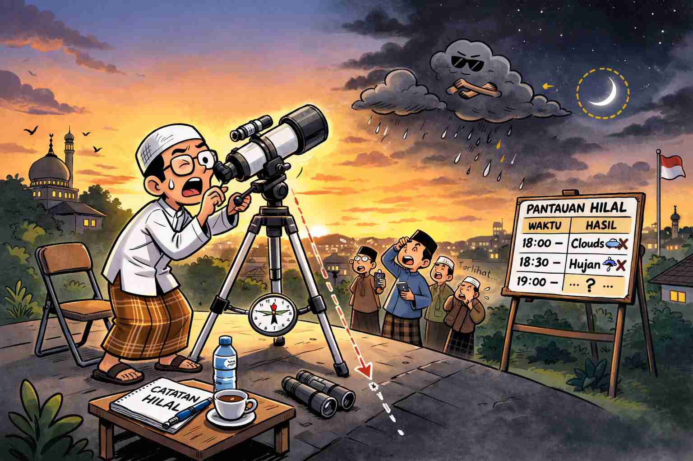

Muhammadiyah mulai puasa pada tanggal 18 Februari 2026 karena menurut mereka
kalau hilal sudah terlihat di manapun di Bumi, maka sudah masuk Ramadan untuk
semua daerah di Bumi. Dan saat ini hilal sudah terlihat di Alaska, Amerika
Serikat.

Menurut pemerintah, kita belum masuk Ramadan karena menurut mereka hilal harus
terlihat di Indonesia sebelum dapat diputuskan masuk bulan Ramadan untuk wilayah
Indonesia.

<!--truncate-->

## Muhammadiyah Lebih Benar

Menurut saya dari kedua pendapat tersebut, yang benar adalah Muhammadiyah karena
batas negara adalah hal yang sifatnya artifisial dan *arbitrary*. Mengapa harus
menggunakan batas wilayah negara sebagai bagian dari kriteria? Dari sudut
pandang ibadah dan agama, tidak ada bedanya saya dan manusia lain yang berada di
seberang batas negara.

Selain itu, sebenarnya bisa saja hilal sudah terlihat di Papua dan pemerintah
menetapkan sudah masuk Ramadan, padahal belum terlihat di Jawa. Jadi sebenarnya
keberatan yang sama juga bisa dialamatkan ke pemerintah dalam kondisi yang
berbeda. Perbedaan pemerintah dan Muhammadiyah hanya dalam hal kriteria cakupan
wilayahnya, di luar kriteria derajat elongasi.

## Kriteria Lokal

Alternatif lain yang mungkin lebih benar daripada Muhammadiyah adalah
menggunakan kriteria lokal. Ramadan dimulai jika di lokasi kita sendiri saat ini
sudah memenuhi kriterianya, dan tidak perlu memperhitungkan apa yang terjadi di
daerah lain, baik di lokasi lain di Indonesia, atau di luar Indonesia. Bisa saja
kita mulai puasa berbeda hari dengan teman di kota lain, walaupun menggunakan
kriteria yang sama dan masih sama-sama di Indonesia.

Dengan cara ini, perbedaan terjadi karena perbedaan letak geografis, bukan
karena perbedaan mazhab atau negara. Selain itu, cara ini juga sudah diterapkan
untuk penentuan waktu shalat, jadi bukan hal asing untuk diterapkan juga untuk
penentuan awal bulan.

## Lebih Merupakan Masalah Komersil/Dagang daripada Masalah Agama

Ribut-ribut awal mulai Ramadan dan Syawal sudah menjadi bagian dari ritual
tahunan di Indonesia. Tapi menurut saya akarnya bukan masalah agama, melainkan
lebih merupakan masalah komersil atau dagang. Penentuan bulan Ramadan dan Syawal
berhubungan dengan penentuan Hari Raya Idul Fitri yang merupakan hari libur
nasional, dan dengan demikian terdapat kebutuhan untuk bisa berlaku untuk
seluruh wilayah Indonesia.

Kalau tidak ada libur Idul Fitri, kita semua bisa menggunakan kriteria lokal,
sebagaimana kita menggunakan kriteria lokal untuk menentukan waktu shalat. Pada
penentuan waktu shalat, juga terdapat perbedaan kriteria antara Muhammadiyah dan
pemerintah, tapi tidak pernah menimbulkan keributan.

Ribut-ribut ini sebenarnya merupakan demonstrasi mengapa kalender Hijriah tidak
cocok digunakan sebagai kalender dagang atau komersil. Kita tidak menggunakan
kalender Hijriah untuk keperluan komersil bukan karena konspirasi Elit Global™,
tapi karena tidak mungkin setiap bulan mengalami keributan seperti ini, dan
sulit untuk mendapatkan kepastian waktu jauh-jauh hari sebelumnya.

## Saya Pribadi

Saya *gak ribet*. Walaupun menurut saya Muhammadiyah lebih benar, saya tetap
ikut puasa sesuai keluarga dan orang-orang di sekitar saya, seperti yang saya
lakukan sejak dulu, yaitu menggunakan keputusan pemerintah.

Gunakan akal sehat dan hati nurani kita untuk memutuskan apa yang benar, dan
tidak perlu tergantung dengan Ulama. Ulama bisa keliru, bisa jahat, dan belum
tentu lebih pintar daripada kita. Banyak dari mereka bisa berada di posisi
mereka hanya karena punya modal politik dan pintar ngomong.

Jaman sekarang sudah ada teknologi, dan masing-masing bisa mulai puasa sesuai
keyakinan dan kriteria masing-masing. Libur Idul Fitri tidak perlu sama dengan
keyakinan kita, sama halnya seperti waktu Zuhur bisa berubah-ubah, tapi jam
istirahat kerja tetap jam 12.00-13.00, dan ibadah tidak perlu mengganggu
kegiatan kerja.
