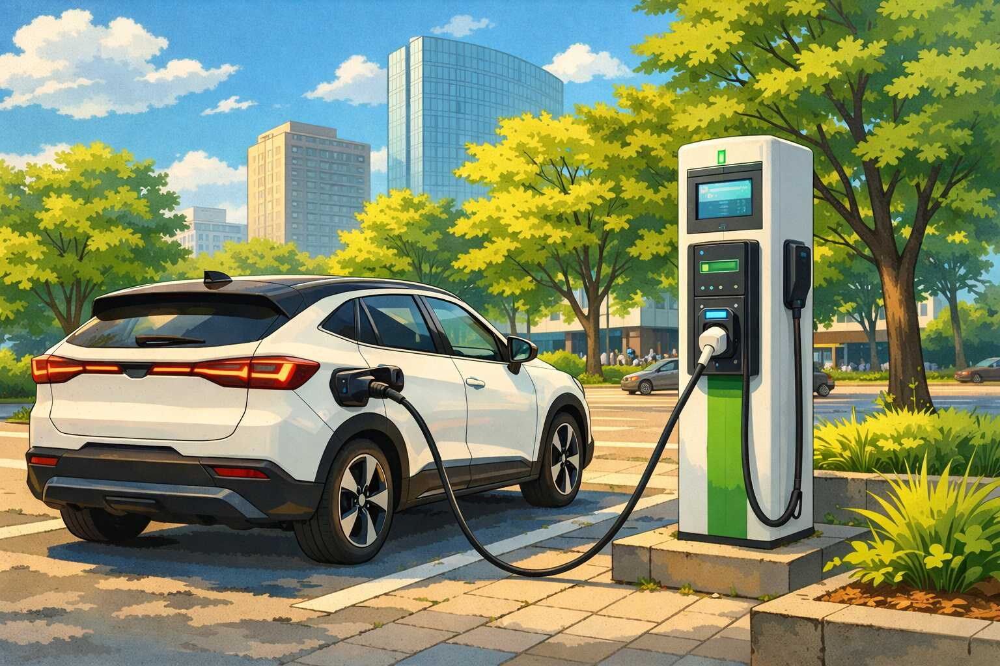

import TimeSensitive from "@site/src/components/TimeSensitive";

Saat ini, terdapat tiga cara utama untuk mengisi daya mobil listrik:

<!-- truncate -->

1. Menggunakan unit dinding, yang memerlukan pemasangan unit khusus yang
   dipasang di garasi atau tempat parkir, dan sambungan PLN khusus, biasanya
   sebesar 7700 watt.

2. Menggunakan unit portabel untuk mengisi daya menggunakan stopkontak biasa,
   yang menggunakan sambungan PLN yang sama dengan yang digunakan oleh lokasi
   tersebut. Untuk rumah tangga, biasanya memiliki daya listrik sebesar 2200-3500
   watt, sehingga pengisian daya akan lebih lambat dibandingkan dengan unit
   dinding.

3. Menggunakan stasiun pengisian daya umum (SPKLU) yang tersedia di berbagai
   lokasi, seperti apartemen, pusat perbelanjaan, tempat kerja, dan jalan raya.

<TimeSensitive written="2026-04-12" />

Untuk penghuni rumah, mengoperasikan mobil listrik bukan masalah. Pengguna hanya
perlu mengisi daya mobil ketika mobil sedang tidak digunakan. Jika mobil parkir
di garasi selama 8 jam, maka itu sudah cukup untuk mengisi daya untuk keperluan
sehari-hari.

* Dengan unit dinding: 8 jam × 7700 watt = 61 kWh, cukup untuk mengisi penuh
  baterai untuk sebagian besar mobil listrik.
* Dengan unit portabel: 8 jam × 2200 watt = 17.6 kWh, hanya cukup untuk mengisi
  sebagian, tetapi sudah cukup untuk jarak tempuh sampai 100 km.

Namun, bagi penghuni apartemen, situasinya berbeda. Opsi yang tersedia biasanya
hanya SPKLU. Di Indonesia, SPKLU terbagi menjadi dua jenis utama:

1. SPKLU Type-2, menggunakan arus AC dengan daya 22 kW.
2. SPKLU CCS-2 *fast charging*, menggunakan arus DC dengan daya antara 50 kW
   hingga 350 kW.

Masalahnya adalah:

* Yang banyak tersedia di berbagai lokasi adalah SPKLU Type-2 22 kW. Sedangkan
  unit CCS-2 tidak sebanyak itu, terutama di kota kecil.
* Yang tertera di brosur kendaraan hanyalah waktu pengisian dengan SPKLU CCS-2
  *fast charging*, yang jauh lebih cepat daripada SPKLU Type-2.
* Unit SPKLU Type-2-nya sendiri mampu mengisi daya dengan kecepatan 22 kW,
  tetapi rata-rata unit kendaraan hanya dapat menerima daya sekitar 7 kW.

Untuk poin terakhir, hal ini seringkali tidak disebutkan di spesifikasi
kendaraan. Yang bisa menerima daya 22 kW melalui Type-2 biasanya hanya kendaraan
buatan Eropa yang lebih mahal.

Bagi penghuni apartemen di kota kecil, seringkali yang tersedia hanya SPKLU
Type-2 22 kW. Untuk mengisi daya dari kosong sampai penuh dengan daya 7 kW
membutuhkan waktu minimal enam jam. Jadi dibutuhkan pengelolaan ekspektasi dan
strategi khusus untuk mengisi daya, misalnya dibarengi dengan kegiatan lain.

Pikirkan pula pengguna lain yang mungkin juga perlu menggunakan SPKLU tersebut.
Jika kita menggunakan SPKLU selama enam jam, maka tidak ada pengguna lain yang
bisa menggunakannya selama waktu tersebut. Dan di kota kecil, SPKLU lain mungkin
tidak tersedia dalam jarak yang wajar.

Sisi baiknya, satu jam pengisian bisa menambah daya sekitar 7 kWh. Untuk mobil
kecil, ini sudah cukup untuk menambah jarak tempuh sekitar 50 km. Dan untuk
penghuni kota kecil, mungkin sudah lebih dari cukup untuk keperluan dua tiga
hari. Jika kebetulan bepergian ke kota besar, maka gunakan kesempatan tersebut
untuk mengisi daya dengan SPKLU CCS-2 *fast charging* sampai penuh.
