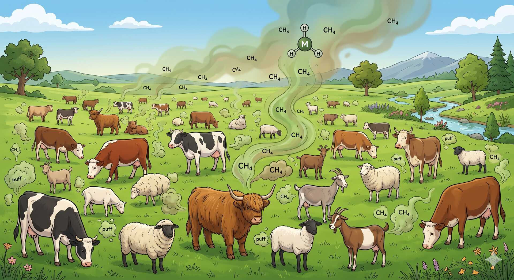
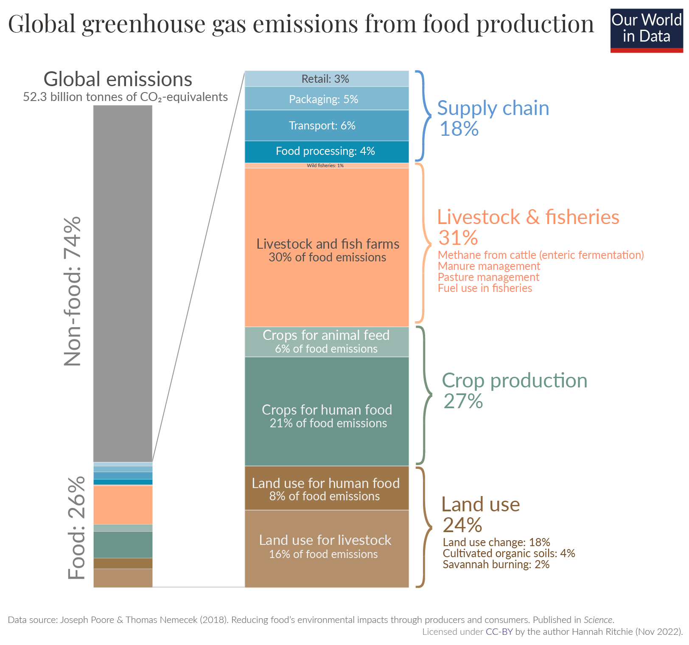

Mari kita bahas dampak dari ibadah kurban terhadap perubahan iklim, dan mengapa
saya memutuskan untuk tidak lagi melakukan ibadah kurban.

<!-- truncate -->

## Dampak Perubahan Iklim dari Hewan Ternak

[Hewan pemamah biak](https://en.wikipedia.org/wiki/Ruminant) seperti sapi,
kambing, dan domba mengonsumsi tanaman yang mengandung selulosa yang sulit
dicerna. Untuk mencernanya, hewan-hewan ini bergantung pada mikroorganisme yang
hidup di dalam perut mereka. Proses pencernaan ini menghasilkan [gas
metana](https://en.wikipedia.org/wiki/Methane) (CH4) sebagai produk
sampingan.

Metana adalah gas rumah kaca yang memiliki [potensi pemanasan
global](https://en.wikipedia.org/wiki/Atmospheric_methane) yang jauh lebih besar
daripada karbon dioksida (CO2). Dalam 20 tahun pertama setelah
dilepaskan, metana memiliki potensi pemanasan global sekitar 84-87 kali lebih
besar daripada CO2. Oleh karena itu, emisi metana dari peternakan
hewan merupakan kontributor
signifikan terhadap perubahan iklim.

100 gram protein yang berasal dari daging sapi menghasilkan [efek gas rumah kaca
yang setara dengan sekitar 50 kg
CO2](https://pubmed.ncbi.nlm.nih.gov/29853680/). Ini lebih dari dua kali
lipat dibandingkan dengan daging kambing atau domba, dan puluhan kali lipat
lebih besar daripada sumber protein nabati seperti kacang-kacangan atau
biji-bijian.

Sebagai perbandingan, kendaraan bensin menghasilkan emisi sekitar 250g CO2eq per
kilometer. Maka 100 gram protein dari daging sapi setara dengan emisi dari
mengemudi sekitar 200 kilometer dengan mobil bensin. Ini memberikan gambaran
yang jelas tentang dampak lingkungan dari konsumsi daging sapi.

Dibandingkan dengan emisi gas rumah kaca secara keseluruhan, sektor peternakan
menyumbang sekitar 14,5% dari total emisi global, dengan sebagian besar berasal
dari metana yang dihasilkan oleh hewan pemamah biak.

## Kurban dan Efeknya Terhadap Konsumsi Daging Secara Keseluruhan

Berdasarkan catatan Kementerian Agama, selama Idul Adha tahun 2025, masyarakat
Indonesia menyembelih lebih dari 600 ribu ekor sapi. Sebagai perbandingan,
jumlah tersebut [setara dengan 65% dari total
sapi](https://www.thestar.com.my/aseanplus/aseanplus-news/2026/05/27/aidiladha-and-indonesias-protein-intake-paradox-comment)
yang disembelih untuk keperluan non-ibadah selama tahun 2025. Sedangkan untuk
kambing dan domba, angkanya bahkan mencapai 740%.

Kondisi zaman sekarang juga tentunya berbeda dengan masa-masa saat agama Islam
pertama kali muncul. Dulu populasi manusia hanya sekitar 250 juta jiwa,
sekarang sudah mencapai 8 miliar jiwa. Jumlah hewan ternak yang ada pun ikut
meningkat secara signifikan. Jadi tidak bisa disamakan dengan kondisi zaman
dulu saat agama Islam pertama kali muncul.

Untuk berkurban, saat ini kita perlu merogoh uang sekitar Rp 30 juta untuk
seekor sapi. Harga tersebut hanya untuk harga sapinya saja, tetapi ada harga
yang tidak kita bayarkan secara langsung, yang biasanya tidak terpikirkan, yaitu
biaya dampak negatif terhadap lingkungan. Biaya ini nantinya harus dibayarkan
oleh anak cucu kita.

## Kesimpulan Pribadi

Berdasarkan data-data tersebut, saya menyimpulkan bahwa ibadah kurban memiliki
jauh lebih banyak dampak negatif, dan memutuskan untuk tidak melakukan ibadah
kurban di masa depan. Posisi ini tetap sejalan dengan ajaran Islam, karena
ibadah kurban bukanlah kewajiban.

Saya berpendapat agama seharusnya menjadi yang pertama menjadi agen perubahan ke
arah yang lebih baik, dan bisa beradaptasi berdasarkan perubahan kondisi di
lapangan dan terhadap pengetahuan baru yang sebelumnya belum kita ketahui.

## Reaksi dan Tanggapan

Karena berbagai macam alasan, terdapat banyak reaksi yang muncul, dan sebagian
besar memiliki pola yang sama. Untuk itu berikut adalah rangkumannya.

> Negara X memiliki produksi atau konsumsi sapi yang lebih tinggi, kenapa kita yang harus berubah?

Argumen dengan pola seperti ini dinamakan [whataboutism](https://en.wikipedia.org/wiki/Whataboutism). Ini adalah jenis argumen yang mencoba untuk mengalihkan perhatian dari isu yang sedang dibahas dengan menunjuk pada isu lain yang dianggap lebih buruk.

Soal lingkungan, jurus argumentasi seperti ini sudah ada sejak tahun 1990-an.
Praktis semua negara pernah menggunakan jurus ini untuk tidak melakukan
perubahan, termasuk negara-negara dengan emisi tinggi seperti Amerika Serikat,
China, dan India. Itu sebabnya masalah iklim tidak pernah terselesaikan.

Dari pada menuntut pihak lain untuk berubah, jauh lebih mudah dimulai dari diri
sendiri.

> Kamu juga masih makan daging, menggunakan AC, dan menggunakan kendaraan bermotor, jadi kamu juga tidak konsisten.

Ini adalah argumen yang dinamakan [tu quoque](https://en.wikipedia.org/wiki/Tu_quoque). Ini adalah jenis argumen yang mencoba untuk membela diri dengan menunjuk pada perilaku atau tindakan yang dianggap sama dari pembuat argumen.

Justru sebenarnya di sini saya tidak menuntut apa-apa dari orang lain. Dan
yang saya lakukan adalah usaha untuk mengurangi emisi karbon dari diri saya
sendiri, karena saya sadar saya masih makan daging, menggunakan AC, dan menggunakan kendaraan bermotor.

Ini juga bentuk argumen yang dinamakan [nirvana
fallacy](https://en.wikipedia.org/wiki/Nirvana_fallacy). Ini adalah jenis
argumen yang mencoba untuk menolak solusi atau tindakan tertentu dengan
menunjukkan bahwa solusi tersebut tidak sempurna atau tidak akan menyelesaikan
masalah sepenuhnya.

Jika seseorang memiliki emisi GHG sebesar 4 ton CO2eq per tahun, lalu
mengurangi emisi tersebut menjadi 3,5 ton CO2eq per tahun, itu sudah
menjadi langkah yang positif. Seseorang yang menggunakan argumentasi nirvana
fallacy akan menuntut pengurangan emisi menjadi 0 ton CO2eq per
tahun, yang tentu saja tidak realistis.

> Konsumsi daging sapi di Indonesia masih kecil, belum saatnya untuk mengurangi
> konsumsi daging sapi.

Kuncinya adalah kata "belum saatnya". Artinya suatu saat akan menjadi "sudah
saatnya". Dan *threshold* antara "belum saatnya" dan "sudah saatnya" itu
berbeda-beda untuk setiap orang. Bagi saya, "sudah saatnya" itu sudah terjadi,
untuk orang lain mungkin belum, baik karena belum tahu, atau karena merasa belum
saatnya.

> Kamu hanya menghalangi orang lain untuk beribadah...

Menurut saya, memperbaiki lingkungan juga merupakan bagian dari ibadah. Maka,
baik melakukan kurban dan tidak melakukan kurban dengan alasan lingkungan,
keduanya adalah bentuk dari ibadah. Jadi bukan menjadi masalah kalau memang
niatnya adalah untuk ibadah.
